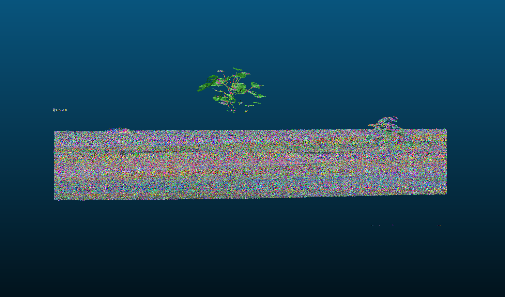
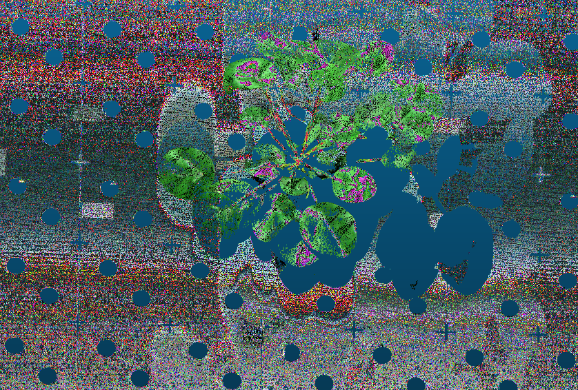
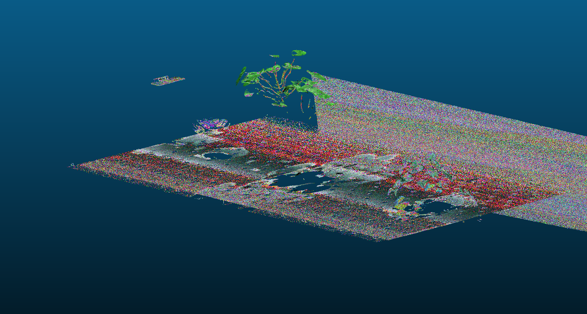

# 3D Surface Reconstruction – PlantEye Point Cloud

A C++ tool that turns the PlantEye point cloud into a triangle mesh.

The main idea: I don't need to search for neighbouring points, because the scanner already gives them.
Every point has a scan line (`profile`) and a position on the laser line (`x_pos`), so the points of
each scanner form a grid. I connect neighbouring grid cells into triangles and skip the ones that jump
between two surfaces, like a leaf edge and the tray below it.

## Build & run

Needs a C++17 compiler and CMake 3.16+. The PLY library (happly) is included in the repo.

```bash
cmake -S . -B build -DCMAKE_BUILD_TYPE=Release
cmake --build build -j
./build/reconstruct data/scan.ply out/mesh.ply
```

`--max-edge MM` is optional (default 5 mm). The analysis scripts in `python/` need
`pip install -r python/requirements.txt`. The final mesh is over 100 MB, so it's attached to the GitHub
release instead of the repo.

## Data analysis

I started with the PLY header, then plotted the data and looked at it in CloudCompare.
`docs/notes.md` has my full log, including what I got wrong at first.


- 3.2 M points from two scanner heads (2.06 M and 1.14 M), looking sideways across the tray from the
  left and the right.
- Units are mm, z points up. The tray is at z ≈ 1785, with plants above it.
- The scene has a perforated tray, two big plants (one ~215 mm higher), a small third plant, a wall
  that only scanner 0 sees, and a few hundred outliers below the tray.
- Point spacing is ~0.7 mm along the laser line and ~0.82 mm between scan lines. Noise on the flat
  tray is ~0.5 mm, and the two scanners see the tray ~0.94 mm apart.

Every (scanner, profile, x_pos) is unique. To check that grid neighbours are also neighbours in 3D, I
measured the distance from each point to the next cell:


Most distances are 0.67–0.83 mm, which matches the spacing. The long tail (10–500 mm) is jumps between
surfaces, and there is a dip around 5 mm between the two groups.

## Approach

Per scanner:
1. Put the points in a grid (row = profile, column = x_pos).
2. Slide a 2×2 window over it. Each window gives two triangles.
3. Keep a triangle only if all three cells have a point and all edges are shorter than 5 mm.
4. Flip the triangles if most of them face down, so they face the scanner.

Then for the whole mesh:
5. Remove points that are in no triangle. This also removes the outliers.
6. Compute a normal per point and write a binary PLY with colours. The colours are scaled to the
   99.9th percentile, because dividing the 16-bit values by 65,535 makes everything almost black.

I chose this over Poisson or Ball Pivoting because the data already has the structure. It's simple,
fast, stays exactly on the measured points, and doesn't turn thin leaves into closed blobs.

## Evaluation

I picked max edge from the histogram dip and then tested it:

| max edge | triangles | change |
|---|---|---|
| 3 mm | 4,452,310 | |
| 5 mm | 4,521,842 | +69,532 |
| 8 mm | 4,522,490 | +648 |

Going from 3 to 5 mm adds ~70 k triangles, almost all on the wall, which scanner 0 sees at a steep
angle. So 3 mm cuts real surface. From 5 to 8 mm almost nothing changes (0.01 %), so the result
doesn't depend much on the exact value. That's why 5 mm is the default and the parameter is optional.

With 5 mm:
- 2,956,718 of 3,198,659 points end up in the mesh (92.4 %), in 4,521,842 triangles.
- The whole run takes 1.3 s on my Mac (load 0.5 s, triangulation 0.1 s, write 0.6 s).
- In CloudCompare: the leaves are separate surfaces, the tray holes stay open, and nothing connects
  the tall plant to the tray.





## Limitations

- Where both scanners see the same surface, there are two layers ~1 mm apart.
- The surface is rough, because the noise (~0.5 mm) is close to the point spacing. I don't smooth it.
- Areas hidden behind leaves have no data, so the mesh has holes there. I don't fill them, because that
  would be invented surface.
- Every 2×2 window is split along the same diagonal, so some possible triangles at edges are missed.
- 5 mm is an absolute value that fits this scanner. Another resolution would need a different value.
- I wanted to compare with Open3D Poisson, but Open3D crashed on my Mac and I ran out of time.

## With more time

1. Merge the two scanners into one layer in the overlap.
2. Compare with Poisson and Ball Pivoting (triangle count, runtime, how much surface they invent).
3. Try the other diagonal when a triangle fails, and derive max edge from the measured spacing.
4. Unit tests on small hand-made grids.
