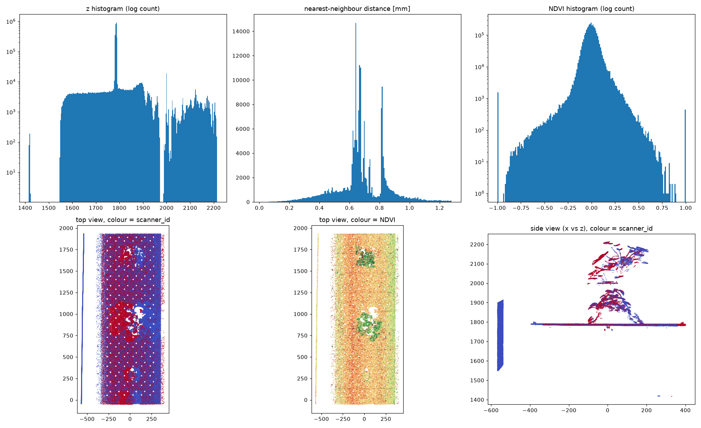
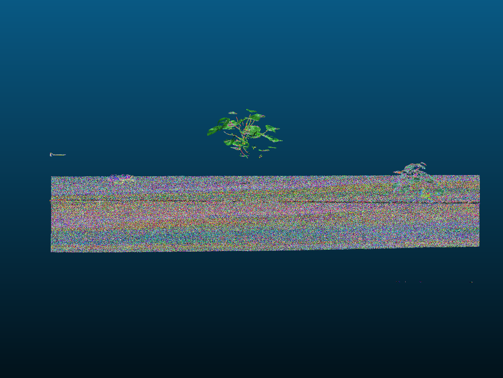
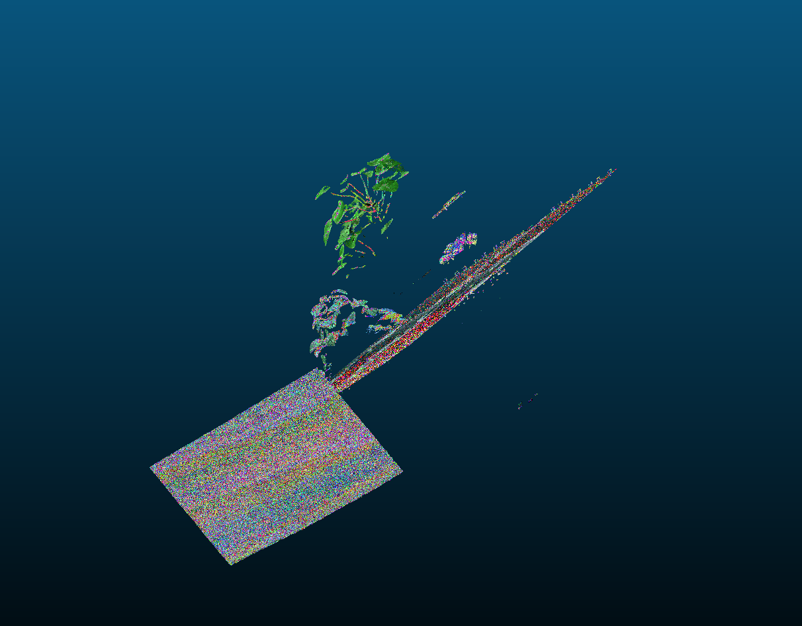
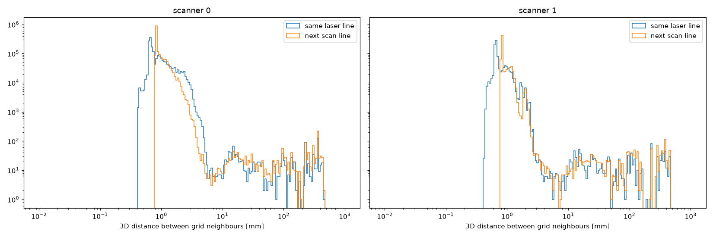

# Development notes

My log of how I worked on this exercise: what I did, what I thought, and where I was wrong.
The README is the clean summary.

## 1. Getting oriented

- Refreshed what a point cloud and a mesh are. A point cloud is loose 3D points, a mesh adds
  triangles between them.
- Read about the usual reconstruction algorithms (Poisson, Ball Pivoting, ...), filtering and
  outliers, and typical problems like thin leaves and missing data.
- Picked the tools: Python for exploring and prototyping, C++ for the actual tool.
- Set up the repo with CMake, a Makefile for shortcuts and GitHub CI that builds on Linux and macOS.

### The PLY header
Each point has x, y, z, `scanner_id`, `profile`, `x_pos` and red/green/blue/NIR. The header shows
two PlantEye heads. My first thought: if `x_pos` is really the position on the laser line, I already
have the points and only need to connect them into triangles.

Questions I had:
- Is `x_pos` the column on the laser line?
- How are the two scanners placed?
- Does z point up or down?
- Why does scanner 0 have almost twice as many points?

## 2. First look at the data

What I first thought:
- The red scanner has more points.
- The blue one has a weird stripe on the left.
- Every (scanner, profile, x_pos) is unique, so the grid idea works.
- The nearest-neighbour distances are one peak, as expected.

What it actually is:
- Blue is scanner 0 and it has more points (2.06 M vs 1.14 M). Overlapping scatter plots can't show
  counts.
- The stripe is a vertical wall at x ≈ −560, only seen by scanner 0.
- z points up. The tray is at z ≈ 1785 and the plants are above it.
- The scanners look sideways across the tray: scanner 0 from the right, scanner 1 from the left.
- y only depends on the scan line (4,864 unique y values = number of profiles of both scanners).
- Unique cells is a good sign, but it doesn't yet prove that grid neighbours are close in 3D.
- The distance plot has two peaks: ~0.69 mm (next point on the laser line) and ~0.81 mm (next scan
  line, 1980 mm / 2431 profiles).
- There are a few hundred outlier points around z ≈ 1415, far below the tray.
- Colours are 16-bit but only go up to ~11,000, so dividing by 65,535 would give a nearly black mesh.

### Checked in CloudCompare
I opened the scan in CloudCompare and rotated around it. One plant stands much higher than the
other, and from another angle a third, small plant is visible.

## 3. Testing the grid

For each scanner I built the (profile, x_pos) grid and measured the 3D distance from each point to
the next cell on the same laser line and on the next scan line.

| | scanner 0 | scanner 1 |
|---|---|---|
| median distance, same laser line | 0.75 mm | 0.67 mm |
| median distance, next scan line | 0.83 mm | 0.82 mm |
| 90 % of same-line pairs below | 1.79 mm | 1.14 mm |
| tray height / noise (std) | 1786.2 / 0.47 mm | 1787.2 / 0.50 mm |

What I first thought:
- The 90 % value of 1.79 mm is the important number, so pairs further apart than ~2–3.5 mm mean a
  jump to another surface and shouldn't be connected.
- A 0.94 mm height difference between the scanners is small.

What it actually means:
- The medians match the expected spacing, so grid neighbours really are neighbours in 3D.
- Cutting at a percentile would throw away real surface. The 1.79 mm comes from the wall: scanner 0
  sees it at a steep angle, so its points are further apart. Scanner 1 doesn't see the wall.
- The better place for the threshold is the dip in the histogram: real neighbours stop at ~5 mm,
  jumps (leaf edge to tray) start at ~10 mm. Starting value: 5 mm.
- 0.94 mm is about two times the noise, so the scanners really see the tray at different heights.
  Where both scanners see the same area, there will be two layers on top of each other.
- The noise (~0.5 mm) is almost as big as the point spacing (~0.75 mm), so the raw surface will look
  rough.